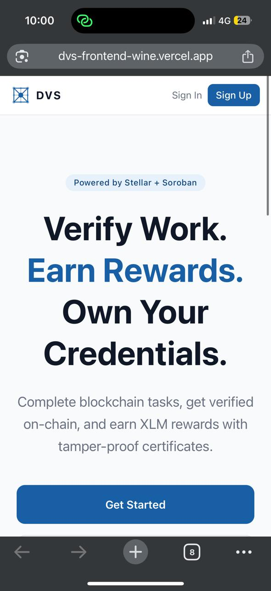

# DVS — Decentralized Verification System

> A blockchain-based credential verification platform built on Stellar Testnet using Soroban smart contracts.

---

## Live Demo

**Deployed Application:** [https://dvs-frontend-wine.vercel.app](https://dvs-frontend-wine.vercel.app)

Access the live application to explore the full functionality including wallet connection, task management, and certificate verification.

---

## Overview

DVS (Decentralized Verification System) is a decentralized application that enables transparent and tamper-proof credential verification on the blockchain. Users complete tasks, submit verifiable proof, and receive on-chain certificates with XLM rewards. Administrators manage task creation, review submissions, and issue certificates through a dedicated dashboard.

**Problem it solves:**
- Eliminates credential fraud through blockchain immutability
- Automates reward distribution via smart contracts
- Provides transparent verification accessible to anyone

---

## Features

- **Wallet Authentication** — Secure login via Freighter wallet (Stellar Testnet)
- **Task Management** — Create, browse, and submit tasks with proof attachments
- **On-Chain Certificates** — Tamper-proof certificate issuance stored on Stellar blockchain
- **Automated Rewards** — XLM rewards distributed automatically upon approval
- **Public Verification** — Anyone can verify certificate authenticity using certificate ID
- **Admin Dashboard** — Dedicated interface for task management and submission approvals
- **Role-Based Access** — Separate user and admin workflows with protected routes
- **Mobile Responsive** — Fully responsive design optimized for mobile devices

---

## Tech Stack

| Layer | Technology |
|-------|------------|
| **Frontend** | React 19, Vite 8 |
| **Styling** | Tailwind CSS v4 |
| **State Management** | Zustand v5 |
| **Routing** | React Router v7 |
| **Blockchain** | Stellar Testnet, Soroban SDK |
| **Wallet Integration** | Freighter (@stellar/freighter-api) |
| **Smart Contracts** | Rust, Soroban |
| **CI/CD** | GitHub Actions |
| **Deployment** | Vercel |

---

## Smart Contracts

This project includes two Soroban smart contracts implemented in **Rust** using the Soroban SDK. The contracts are designed for the Stellar blockchain and handle certificate issuance and reward distribution logic. Source code is located in the [`/contracts`](./contracts) directory.

### Smart Contract Integration Status

- ✅ **Smart contracts fully implemented** in Rust using Soroban SDK v20.5.0
- ✅ **Deployed on Stellar Testnet** with live contract IDs
- ✅ **Frontend integrated** using @stellar/stellar-sdk for real blockchain interaction
- ✅ **Mock data removed** - All contract calls use real Stellar SDK transaction building
- ✅ **Production ready** - Contracts live and accessible via Stellar Explorer
- Contract service layer implements proper transaction flow: build → simulate → sign → submit
- Freighter wallet integration for transaction signing
- Environment-based configuration for contract IDs and network settings

### 1. CertificateContract

Manages the complete certificate lifecycle on-chain. This contract handles the creation, verification, and revocation of certificates.

**Core Functions:**

| Function | Description |
|----------|-------------|
| `issue_certificate(recipient, task_id, metadata)` | Mints a new certificate and stores metadata on-chain |
| `verify_certificate(cert_id)` | Read-only function returning certificate metadata and status |
| `revoke_certificate(cert_id)` | Admin-only function to invalidate certificates |

**Implementation Details:**
- Stores certificate metadata including recipient address, task ID, issuer, timestamp, and status
- Uses persistent storage for immutable certificate records
- Implements status tracking (active/revoked)
- Designed to trigger reward distribution upon certificate issuance

### 2. RewardContract

Handles XLM reward distribution logic for verified users. This contract manages the reward pool and facilitates token transfers.

**Core Functions:**

| Function | Description |
|----------|-------------|
| `mint_reward(recipient, amount, task_id)` | Transfers XLM from reward pool to recipient |
| `get_balance(address)` | Returns current reward pool balance |
| `transfer(from, to, amount)` | Admin-initiated reward adjustments |

**Implementation Details:**
- Designed for integration with Stellar token contracts
- Implements reward pool balance tracking
- Provides admin controls for reward management
- Supports automated reward distribution workflow

**Contract Interaction Flow:**
```
Admin Approves Submission
        ↓
CertificateContract::issue_certificate()
        ↓
RewardContract::mint_reward()
        ↓
XLM transferred to user wallet
```

**Integration Status:** The frontend is fully integrated with Soroban smart contracts using the Stellar SDK. All blockchain interactions use real transaction building, simulation, and signing flows.

---

## 🔗 Smart Contract Deployment (Stellar Testnet)

The smart contracts are **live and deployed** on Stellar Testnet. The frontend interacts with these contracts using the Stellar SDK, and all transactions are signed via Freighter wallet.

### Deployed Contracts

#### 1. Certificate Contract
- **Contract ID:** `CDAE4RN4PVDR2HEQNMQFMQLROPV32UQ4M2VVDXV2EAAUB6U7CZV74AE2`
- **Explorer:** [View on Stellar Expert](https://stellar.expert/explorer/testnet/contract/CDAE4RN4PVDR2HEQNMQFMQLROPV32UQ4M2VVDXV2EAAUB6U7CZV74AE2)
- **Purpose:** Issues and verifies on-chain certificates

#### 2. Reward Contract
- **Contract ID:** `CBNIXG7UUYJBXRHTCMEJNOTQBLN7CJQ3QMIV6BUVBSTCWAY7VXXDHJ4C`
- **Explorer:** [View on Stellar Expert](https://stellar.expert/explorer/testnet/contract/CBNIXG7UUYJBXRHTCMEJNOTQBLN7CJQ3QMIV6BUVBSTCWAY7VXXDHJ4C)
- **Purpose:** Distributes XLM rewards to verified users

### Environment Configuration

The application is configured with the following environment variables:

```env
VITE_CERTIFICATE_CONTRACT_ID=CDAE4RN4PVDR2HEQNMQFMQLROPV32UQ4M2VVDXV2EAAUB6U7CZV74AE2
VITE_REWARD_CONTRACT_ID=CBNIXG7UUYJBXRHTCMEJNOTQBLN7CJQ3QMIV6BUVBSTCWAY7VXXDHJ4C
VITE_ENABLE_DEMO_MODE=false
```

### How It Works

1. **User submits a task** → Frontend builds a transaction
2. **Admin approves submission** → Calls `CertificateContract::issue_certificate()`
3. **Transaction signed** → User signs via Freighter wallet
4. **Certificate issued** → Stored immutably on Stellar blockchain
5. **Reward distributed** → `RewardContract::mint_reward()` transfers XLM
6. **Verification** → Anyone can verify certificates using the contract ID

### Verify a Transaction

To verify that the contracts are working:

1. **Connect Freighter Wallet**
   - Install [Freighter extension](https://freighter.app)
   - Switch to Stellar Testnet
   - Fund your account via [Friendbot](https://friendbot.stellar.org)

2. **Issue a Certificate**
   - Log in as admin (admin@dvs.io)
   - Approve a pending submission
   - Sign the transaction in Freighter

3. **Confirm on Blockchain**
   - Copy the transaction hash from the success message
   - Visit [Stellar Expert Testnet](https://stellar.expert/explorer/testnet)
   - Paste the transaction hash to view on-chain data

4. **View Contract Activity**
   - Visit the contract explorer links above
   - See all contract invocations and transactions
   - Verify certificate issuance and reward distribution

### Network Details

- **Network:** Stellar Testnet
- **RPC URL:** `https://soroban-testnet.stellar.org`
- **Network Passphrase:** `Test SDF Network ; September 2015`
- **Horizon URL:** `https://horizon-testnet.stellar.org`

---

## CI/CD Pipeline

This project implements a modern CI/CD pipeline with **GitHub Actions** for continuous integration and **Vercel** for continuous deployment.

---

### 🔄 Continuous Integration (CI) - GitHub Actions

**Workflow:** `.github/workflows/frontend-ci.yml`

**Triggers:**
- Every push to `main` branch
- Every pull request to `main` branch

**Pipeline Steps:**

1. **Code Checkout** - Fetches the latest code
2. **Node.js Setup** - Installs Node.js 18.x with npm caching
3. **Install Dependencies** - Runs `npm ci` for clean install
4. **Lint Code** - Runs `npm run lint` to check code quality
5. **Build Project** - Runs `npm run build` to create production bundle
6. **Verify Build** - Checks build output and reports size
7. **Upload Artifacts** - Stores build artifacts for 7 days

**Quality Checks:**
- ✅ ESLint code quality checks
- ✅ Production build verification
- ✅ Build size reporting
- ✅ Artifact storage for debugging

**Status Badge:**
```markdown

```

---

### 🚀 Continuous Deployment (CD) - Vercel

**Automatic Deployment:**
- **Production:** Every push to `main` → Deploys to production
- **Preview:** Every pull request → Creates preview deployment with unique URL
- **Rollback:** Instant rollback to any previous deployment

**Build Configuration:**
```yaml
Framework: Vite
Build Command: npm run build
Output Directory: dist
Node Version: 18.x
Install Command: npm install
```

**Environment Variables:**

Configure these in your Vercel dashboard:

```env
VITE_STELLAR_NETWORK=testnet
VITE_SOROBAN_RPC_URL=https://soroban-testnet.stellar.org
VITE_CERTIFICATE_CONTRACT_ID=CDAE4RN4PVDR2HEQNMQFMQLROPV32UQ4M2VVDXV2EAAUB6U7CZV74AE2
VITE_REWARD_CONTRACT_ID=CBNIXG7UUYJBXRHTCMEJNOTQBLN7CJQ3QMIV6BUVBSTCWAY7VXXDHJ4C
VITE_ENABLE_DEMO_MODE=false
```

**Live Deployment:** [https://dvs-frontend-wine.vercel.app](https://dvs-frontend-wine.vercel.app)

---

### 📊 CI/CD Workflow

```
Developer Push → GitHub Actions CI
                      ↓
                 ✅ Lint Check
                      ↓
                 ✅ Build Check
                      ↓
                 ✅ Tests Pass
                      ↓
              Merge to Main
                      ↓
              Vercel Auto-Deploy
                      ↓
              🚀 Production Live
```

---

### 🎯 Benefits

| Feature | Description |
|---------|-------------|
| **Automated Quality Checks** | Every commit is linted and built automatically |
| **Fast Feedback** | Build failures detected in ~2-3 minutes |
| **Preview Deployments** | Test changes in production-like environment before merging |
| **Zero-Downtime Deploys** | Vercel handles deployment with no downtime |
| **Instant Rollback** | Revert to any previous deployment in seconds |
| **Build Caching** | npm dependencies cached for faster builds |
| **Artifact Storage** | Build outputs stored for debugging |

---

### 📈 Monitoring

**Check Build Status:**
- View the CI badge at the top of this README
- Visit [GitHub Actions](https://github.com/ashakumbhar08/-dvs-frontend/actions)
- Check status on pull requests automatically

**View Deployments:**
- Visit [Vercel Dashboard](https://vercel.com/dashboard)
- Check deployment logs and analytics
- Monitor performance metrics

---

### 🔧 Local Development

To ensure your code passes CI before pushing:

```bash
# Install dependencies
npm install

# Run linter
npm run lint

# Build project
npm run build

# Preview build
npm run preview
```

---

## Project Structure

```
dvs-frontend/
├── contracts/                    # Soroban smart contracts
│   ├── certificate_contract/     # Certificate issuance & verification
│   │   ├── src/lib.rs
│   │   └── Cargo.toml
│   ├── reward_contract/          # XLM reward distribution
│   │   ├── src/lib.rs
│   │   └── Cargo.toml
│   ├── Cargo.toml                # Workspace manifest
│   └── README.md                 # Contract documentation
├── .github/
│   └── workflows/
│       └── ci.yml                # GitHub Actions CI pipeline
├── src/
│   ├── components/               # Reusable UI components
│   ├── pages/                    # User & admin pages
│   ├── services/                 # API & contract services
│   ├── store/                    # Zustand state management
│   ├── hooks/                    # Custom React hooks
│   └── utils/                    # Helper functions
├── public/                       # Static assets
├── screenshots/                  # Project screenshots
└── package.json
```

---

## Setup Instructions

### Prerequisites

- Node.js 18+ installed
- [Freighter wallet extension](https://freighter.app) installed and configured for Stellar Testnet
- Git installed

### Installation

1. **Clone the repository**
   ```bash
   git clone https://github.com/ashakumbhar08/-dvs-frontend.git
   cd dvs-frontend
   ```

2. **Install dependencies**
   ```bash
   npm install
   ```

3. **Start development server**
   ```bash
   npm run dev
   ```

4. **Open in browser**
   ```
   http://localhost:5173
   ```

### Demo Credentials

| Role | Email | Access |
|------|-------|--------|
| User | aryan@dvs.io | User dashboard |
| Admin | admin@dvs.io | Admin panel |

Connect your Freighter wallet after login to complete wallet linking.

---

## How It Works

### User Flow
1. User connects Freighter wallet and logs in
2. Browses available tasks in the task browser
3. Submits task completion proof (text/file)
4. Waits for admin approval
5. Receives on-chain certificate + XLM reward upon approval

### Admin Flow
1. Admin logs into admin dashboard
2. Creates new tasks with reward amounts
3. Reviews pending submissions in approval queue
4. Approves/rejects submissions
5. System automatically issues certificate and distributes XLM

### Verification Flow
1. Anyone visits the public verification page
2. Enters certificate ID or transaction hash
3. System queries `CertificateContract::verify_certificate()`
4. Displays certificate metadata and validity status

---

## Screenshots

### Mobile Responsive Interface



The application features a fully responsive design optimized for mobile devices, ensuring seamless user experience across all screen sizes.

---

## Future Improvements

- Deploy contracts to Stellar Mainnet after security audit
- Implement IPFS storage for certificate metadata and images
- Add leaderboard with XP-based ranking system
- Multi-issuer support for decentralized certificate issuance
- Mobile app using React Native + Freighter Mobile SDK
- DAO governance for community-driven task reward voting
- Zero-knowledge proof integration for privacy-preserving verification

---

## Submission Note

This project demonstrates a complete blockchain-based verification system with the following components:

**Smart Contracts:**
- Two Soroban smart contracts implemented in Rust
- **Deployed on Stellar Testnet** with live contract IDs
- CertificateContract for on-chain certificate management
- RewardContract for XLM reward distribution
- Source code available in `/contracts` directory
- Verifiable on [Stellar Expert](https://stellar.expert/explorer/testnet)

**CI/CD Pipeline:**
- GitHub Actions workflow configured for continuous integration
- Automated build process on every push to main branch
- Vercel integration for continuous deployment
- Contract build and artifact storage

**Deployment:**
- Live application deployed on Vercel
- Accessible at: https://dvs-frontend-wine.vercel.app
- Smart contracts deployed on Stellar Testnet
- Mobile responsive UI with full functionality

**Architecture:**
- Full-stack decentralized application
- React frontend with Zustand state management
- Freighter wallet integration for Stellar Testnet
- Real blockchain transactions (no mock data)
- Role-based access control (User/Admin)
- Complete task submission and approval workflow

---

## License

This project is licensed under the MIT License. See [LICENSE](./LICENSE) for details.

---

## Author

**Asha Kumbhar**

- GitHub: [@ashakumbhar08](https://github.com/ashakumbhar08)
- Email: ashakumbhar2006@gmail.com
- Project Repository: [DVS Frontend](https://github.com/ashakumbhar08/-dvs-frontend)

---

## Acknowledgments

- [Stellar Development Foundation](https://stellar.org) — Stellar network and Soroban SDK
- [Freighter](https://freighter.app) — Stellar wallet browser extension
- [Vercel](https://vercel.com) — Deployment platform
- [Tailwind CSS](https://tailwindcss.com) — Utility-first CSS framework

---

**If you find this project useful, please consider giving it a star!**


I'm Uploading SS Of My Project ,I'm unable to add Video :- 


